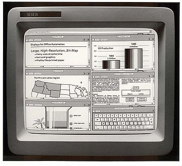

# You Don't Need GUI

<details>
It's for noobs :)
</details>

Graphical user interfaces are super friendly to computer users. They were introduced in reaction to the perceived steep learning curve of command-line interfaces (CLIs).



However, They often require more resources, are less powerful and hard to automate via scripting.

As a computer expert, we want to be more efficient and do our jobs better. We know that command words may not be easily discoverable or mnemonic, so we try to list some common tasks that you might tempt to do in GUI.

## copy a file

**STOP DRAG AND DROP A FILE, OR CMD/CTRL + C, CMD/CTRL + V A FILE**

Copy `readme.txt` to the `documents` folder

```
cp readme.txt documents
```

## duplicate a file

**STOP RIGHT CLICK AND DUPLICATE FILE**

If `readme.bak.txt` file doesn't exist

```
cp readme.txt readme.bak.txt
```

## copy a folder

**STOP DRAG AND DROP A FOLDER, OR CMD/CTRL + C, CMD/CTRL + V A FOLDER**

Copy `myMusic` folder under `myMedia` folder

```
cp -R myMusic myMedia
```

## duplicate a folder

**STOP RIGHT CLICK AND DUPLICATE FOLDER**

If `myMedia` folder doesn't exist

```
cp -R myMusic myMedia
```

## move a file

**STOP DRAG AND DROP A FILE, OR CTRL + X, CTRL + V A FILE**

```
mv readme.txt documents
```

## move a folder

**STOP DRAG AND DROP A FOLDER, OR CTRL + X, CTRL + V A FOLDER**

```
mv myMedia myMusic
```

## new file

**STOP RIGHT CLICK AND CREATE A NEW FILE**

```
touch 'new file'
```

## new folder

**STOP RIGHT CLICK AND CREATE A NEW FOLDER**

```
mkdir 'untitled folder'
```

or

```
mkdir -p 'path/may/not/exist/untitled folder'
```

## file/folder size

**STOP RIGHT CLICK AND SHOW FILE/FOLDER INFO**

```
stat -x readme.md
```

## open a file with default program

**STOP DOUBLE CLICKING A FILE**

```
open file
```

## zip a folder

**STOP RIGHT CLICK AND COMPRESS FOLDER**

```
zip -r archive_name.zip folder_to_compress
```

## unzip

**STOP RIGHT CLICK AND UNCOMPRESS FOLDER**

```
unzip archive_name.zip
```

## remove a file

**STOP RIGHT CLICK AND DELETE FILE OR DRAG IT TO RECYCLE**

```
rm my_useless_file
```

## remove a folder

**STOP RIGHT CLICK AND DELETE FOLDER OR DRAG IT TO RECYCLE**

```
rm -rf my_useless_folder
```

## see my folder

**STOP OPENING YOUR FINDER OR FILE EXPLORER**

```
ls -la my_folder
```

Remember, you can always google or `man` the commands you are not familiar with.
